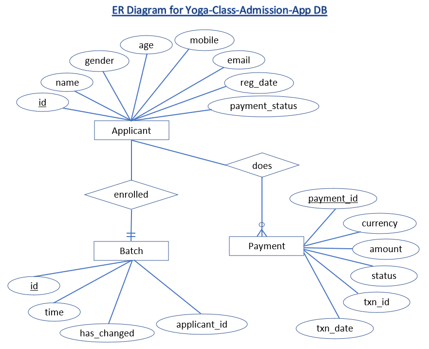

# Yoga Class Admission App 🚀[Prod Link](https://yoga-session-admission-app.ashusharmaprod.repl.co/)

This is web application for applicant to register for Yoga classes, basis following condition:
- Only people within the age limit of 18-65 can enroll for the monthly classes and by paying the fees on month on month basis; i.e. an individual will have to pay the fees every month and he can pay it any time of the month.
- They can enroll on any day but they will have to pay for the entire month. The monthly fee is Rs 500 /-
- There are a total of 4 batches a day namely 6-7AM, 7-8AM, 8-9AM and 5-6PM. The participants can choose any batch in a month and can move to any other batch next month; i.e. participants can shift from one batch to another in different months but in same month they need to be in same batch


To run this app locally, clone this repo and then:
- Configure the below environment variables in `.env` file before running the app:
```
LIVE_DB_HOST  -------> for Database Host
LIVE_DB_NAME  -------> for Database Name
LIVE_DB_USER=sql6583958  -------> for Databse Username
LIVE_DB_PASSWORD=HlkndXWUwr  -------> for Database user password
LIVE_DB_PORT=3306  ------->for Database Port
```
- asuming that nodejs is already installed execute the following commands:
```
npm install
npm start
```
- browse the application locally on below url:
> http://localhost:7777/


To run this app in docker container:
- configure environment variable as suggested above.
- execute the below docker command:
```
> docker build -t yoga-registration-app   
# copy the image-id logged which will be used in next cmd

> docker run -p 7777:8888  <image-id>
# in the above command 7777 is the port number which can be used to browse app running in docker container on PORT 8888
```
- browse the below url:
> http://localhost:7777/


## About the application and its design
Home page of this web app serves the form to submit in order to join yoga-session.

There are three tables in one database, namely- applicant, batch, payment.

Once the form is submitted, applicant's details is populated in `applicant table` followed by `batch table` which stores in which batch a particular candidate is enrolled in.

Batch table has an entity named `has_changed` which has value either `0` or `1`. `0` means applicant has not changed their batch time in the current month, therefore that applicant is eligible to change their batch shift. If applicant request to change their time then first it checks in table, if `has_changed` column is `1` then she/he is not eligible to change their time in that particular, though he/she can change it in next month. When applicant changes their batch, value for `has_changed` column is changed to `1`.



Relationship Cardinality between `Applicant` and `Batch` is `Mandatory One`, since each applicant can be enrolled in only one batch.

Relationship Cardinality between `Applicant` and `Payment` is `Optionally Many`, since each applicant needs to pay fees every month in order to continue attending classes. Though applicant may choose not to continue in any particular month.

As of now, when applicant submit the admission form `makePayment()` function is there which can be later implemented to make actual payment; currently this only inserts payment details with randomly generated transaction id.

There is a monthly cronjob which runs at `00:00 am` on first day of the every month. This makes changes in `batch table`. All the record are set to `0` for `has_changed` column, so that all applicants are once eligible for batch change in every month.

## Technology used
>Node.js, Express.js, EJS, HTML, CSS, Bootstarp, MySQL db, Sequelize, Cronjob, Docker

This web application is developed in node.js and express.js. MySQL database is used with Sequelize ORM. Fronted is served through server-side templating with the help of EJS (Embedded JavaScript Templating). Dockerfile can be used to build docker-image and run this app in container.

## Prod
> https://yoga-session-admission-app.ashusharmaprod.repl.co/